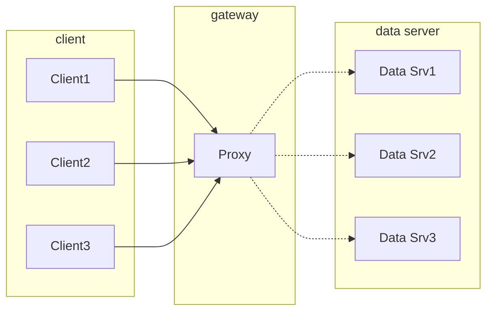
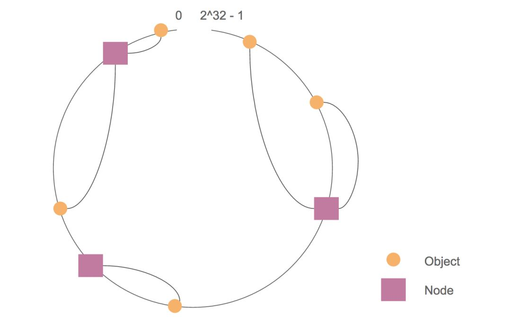

# 2020-03-09 时代银通分享

## 主题

一致性 Hash 算法

## 问题

将数据分离到多台机器，需要快速找到数据所在服务器。这时可以通过 Hash 映射，将数据求 Hash，基于 Hash 结果取模，决定使用的机器，这个场景基本可解决。

如图：

但是，一旦后面任一一台数据服务器宕机，或者需添加一台数据服务器，就面临：

- 问题1：当缓存服务器数量发生变化时，会引起缓存的雪崩，可能会引起整体系统压力过大而崩溃（大量缓存同一时间失效）。

- 问题2：当缓存服务器数量发生变化时，几乎所有缓存的位置都会发生改变，怎样才能尽量减少受影响的缓存呢？

## 解决方案

1997 年，一篇论文解决了这个问题： [Consistent Hashing and Random Trees: Distributed Caching Protocols for Relieving Hot Spots on the World Wide Web](https://www.akamai.com/us/en/multimedia/documents/technical-publication/consistent-hashing-and-random-trees-distributed-caching-protocols-for-relieving-hot-spots-on-the-world-wide-web-technical-publication.pdf)

### 细节

与刚才一样，也用到了 Hash，也用到了取模。

但是，取模不再是基于机器数量，而是 $2^{32}$，并且形成一个环。

1. 将机器唯一标识做 Hash，在环上得到位置。
2. 将所有数据的 key 做 Hash，在环上得到位置。

查找时，先找到 key 在环上的位置，然后顺时针找到第一个机器节点，就是需要的机器节点。

### 进一步

由于机器数量总是有限的，可能会在 $2^{32}$ 的环上聚集，导致数据偏重在某一台上。

为了解决这个问题，进一步引入虚拟节点概念：

>  虚拟节点是实际节点在环上的复制品，一个实际节点可以对应多个虚拟节点。

这样，通过虚拟出足够的虚拟节点，将实际节点变相均匀地分布在环上，合理地分布数据。

### 特点

- **平衡性(Balance)**

平衡性是指哈希的结果能够尽可能分布到所有的缓冲中去，这样可以使得所有的缓冲空间都得到利用。很多哈希算法都能够满足这一条件。

- **单调性(Monotonicity)**

单调性是指如果已经有一些内容通过哈希分派到了相应的缓冲中，又有新的缓冲区加入到系统中，那么哈希的结果应能够保证原有已分配的内容可以被映射到新的缓冲区中去，而不会被映射到旧的缓冲集合中的其他缓冲区。简单的哈希算法往往不能满足单调性的要求，如最简单的线性哈希：$x  = (ax + b) mod (P)$，在上式中，P 表示全部缓冲的大小。不难看出，当缓冲大小发生变化时(从 P1 到 P2 )，原来所有的哈希结果均会发生变化，从而不满足单调性的要求。哈希结果的变化意味着当缓冲空间发生变化时，所有的映射关系需要在系统内全部更新。而在 P2P 系统内，缓冲的变化等价于 Peer 加入或退出系统，这一情况在 P2P 系统中会频繁发生，因此会带来极大计算和传输负荷。单调性就是要求哈希算法能够应对这种情况。

- **分散性(Spread)**

在分布式环境中，终端有可能看不到所有的缓冲，而是只能看到其中的一部分。当终端希望通过哈希过程将内容映射到缓冲上时，由于不同终端所见的缓冲范围有可能不同，从而导致哈希的结果不一致，最终的结果是相同的内容被不同的终端映射到不同的缓冲区中。这种情况显然是应该避免的，因为它导致相同内容被存储到不同缓冲中去，降低了系统存储的效率。分散性的定义就是上述情况发生的严重程度。好的哈希算法应能够尽量避免不一致的情况发生，也就是尽量降低分散性。

- **负载(Load)**

负载问题实际上是从另一个角度看待分散性问题。既然不同的终端可能将相同的内容映射到不同的缓冲区中，那么对于一个特定的缓冲区而言，也可能被不同的用户映射为不同的内容。与分散性一样，这种情况也是应当避免的，因此好的哈希算法应能够尽量降低缓冲的负荷。

- **平滑性(Smoothness)**

平滑性是指缓存服务器的数目平滑改变和缓存对象的平滑改变是一致的。

## 适用场景

1. 缓存

   实际上，Redis 的分槽位也是这个思想。Memcached 需要客户端实现分发，也是这个理由。

2. 合理固定客户

   同一客户始终放一台服务器上处理，避免在分布式环境中多台同时处理一个客户而需要引入锁，提高效率。达到会话粘连效果：将同一个客户导向同一服务器上，进行持续服务。

3. 固定线程执行

   刚才是在机器层面上，在线程任务分发时，引入此概念，可以避免同一客户在多线程下抢锁。没有锁，就能提高处理效率。

## To be continued

明天讲具体的库。

