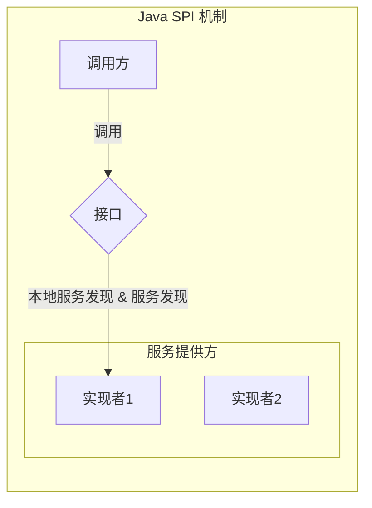

# 2020-03-13 时代银通分享

## 主题

介绍 Java 的 SPI 机制

## 什么是 SPI

Service Provider Interface，简称 SPI。实际上是“**基于接口的编程＋策略模式＋配置文件**”组合实现的动态加载机制。



## 使用场景

**数据库驱动加载接口实现类的加载**

> JDBC加载不同类型数据库的驱动

**日志门面接口实现类加载**

> SLF4J加载不同提供商的日志实现类

**Spring**

> Spring中大量使用了SPI,比如：对servlet3.0规范对ServletContainerInitializer的实现、自动类型转换Type Conversion SPI(Converter SPI、Formatter SPI)等

**Dubbo**

> Dubbo中也大量使用SPI的方式实现框架的扩展, 不过它对Java提供的原生SPI做了封装，允许用户扩展实现Filter接口

## 样例

**Joy**，定义接口

```java
public interface Joy {
    void speak();
}
```

**ServiceLoadDemo**，加载多个实现

```java
public class ServiceLoadDemo {
    public static <T> List<T> loadFromServiceLoader(Class<T> clazz) {
        List<T> list = new ArrayList<>();
        ServiceLoader<T> loader = ServiceLoader.load(clazz);
        Iterator<T> iterator = loader.iterator();
        while (iterator.hasNext()) {
            list.add(iterator.next());
        }
        return list;
    }

}
```

**LoadObjectBySPI**，实际调用者

```java
public class LoadObjectBySPI {
    public static void main(String[] args) {
        List<Joy> list = ServiceLoadDemo.loadFromServiceLoader(Joy.class);
        for (Joy joy : list) {
            joy.speak();
        }
    }
}
```

**demo.Joy.properties**，配置文件，必须放 `META-INF/services`下，以接口全名命名。实现类写里面，一行一个。

```properties
demo.impl.BirdJoy
demo.impl.CatJoy
demo.impl.DogJoy
demo.impl.DuckJoy
demo.impl.FrogJoy
demo.impl.HorseJoy
```

实现类:

```java
public class BirdJoy implements Joy {
    @Override
    public void speak() {
        System.out.println(this.getClass().getSimpleName() + ":tweet");
    }
}
public class CatJoy implements Joy {
    @Override
    public void speak() {
        System.out.println(this.getClass().getSimpleName() + ":meow");
    }
}
public class DogJoy implements Joy {
    @Override
    public void speak() {
        System.out.println(this.getClass().getSimpleName() + ":woof");
    }
}
public class DuckJoy implements Joy {
    @Override
    public void speak() {
        System.out.println(this.getClass().getSimpleName() + ":quack");
    }
}
public class FrogJoy implements Joy {
    @Override
    public void speak() {
        System.out.println(this.getClass().getSimpleName() + ":croak");
    }
}
public class HorseJoy implements Joy {
    @Override
    public void speak() {
        System.out.println(this.getClass().getSimpleName() + ":neigh");
    }
}
```


