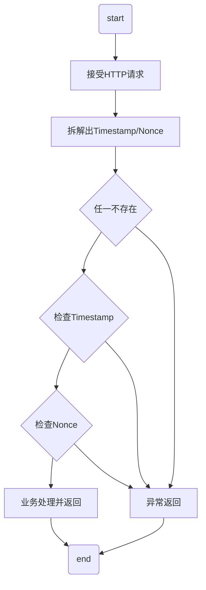

# 2020-03-16 时代银通分享

## 主题

HTTP 防重放攻击（Replay-Attack）

## 什么是 Replay-Attack

顾名思义，重复的会话请求就是重放攻击。
可能是因为用户重复发起请求，也可能是因为请求被攻击者获取，然后重新发给服务器。

## 重放攻击的危害

1. 数据泄漏导致风险
2. 通过重放攻击到达 DDoS 攻击目的

## 防御方法

常见的模式是 timestamp+nonce 组合。

### Nonce

Nonce ，客户端上送，唯一要求是每次唯一。这个唯一要求指本客户上送的每次都要唯一，泛客户间也要唯一。

### Timestamp

Timestamp 时间戳，这里以客户端时间上送。与服务器时间可以有一定时间的容错。

### 流程图

### 正常流程

1. 接受HTTP请求
2. 拆解出 Timestamp 和 Nonce
3. 判断存在，进入下一步，不存在进入异常流程1
4. 检查 Timestamp 是否在服务器容许范围内。一般而言，因为服务器和客户端可能有时间差，所以设计一定的容错空间：设置阈值 n ( $n<5$ ) 分钟，在服务器时间正负阈值范围内，都接受。否则进入异常流程2
5. 检查 Nonce 是否重复。此值有重复，即丢弃此请求，转异常流程3。
6. 进入业务处理，并返回结果

### 异常流程1：没有Timestamp 和 Nonce 任一值

非正常请求，直接返回错误信息

### 异常流程2：Timestamp 超阈值

非正常请求，直接返回错误信息

### 异常流程3：Nonce 重复

非正常请求，直接返回错误信息

## 代码实现

### 关键点：Nonce 判重

**实现方法1**

可以通过 Redis 实现：

> 可将每个 Nonce 加前缀后做 key 放入 redis，值随便，可放最简单的空。再加上过期时间控制。

**实现方法2**

通过内存中 HashMap + 线程定时清理

1. 需要将 Nonce 都放入一个 Map
2. 需要将 Nonce 配置一个过期时间点
3. 需要起一线程定时清理 Nonce，防止内存堆积过多

