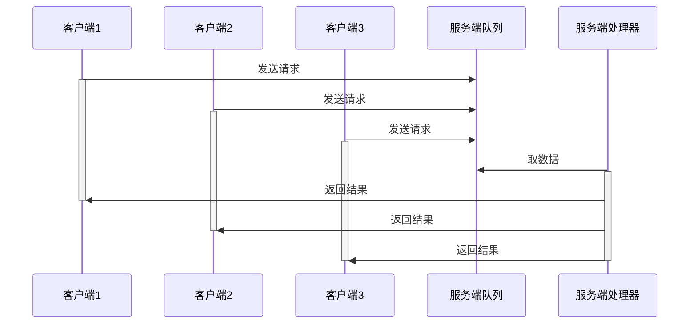
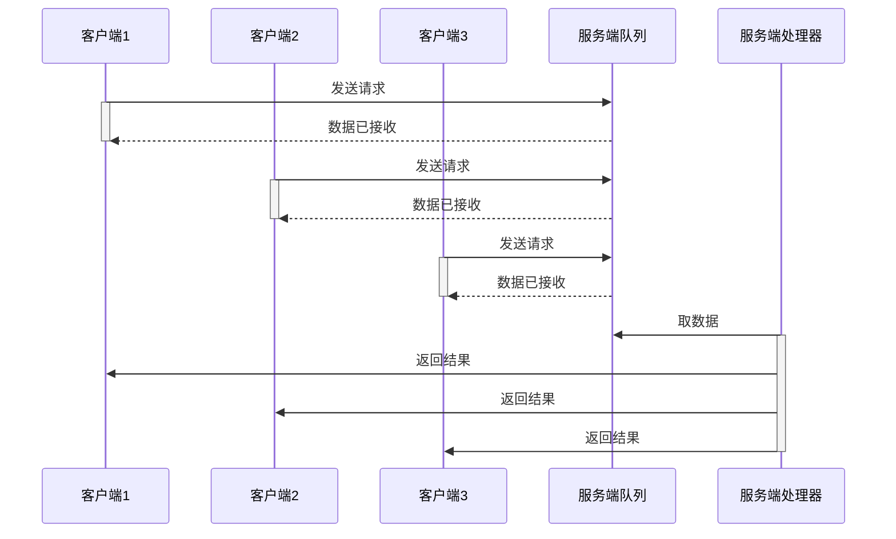
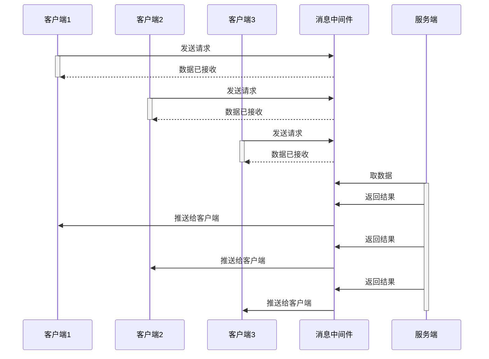

# 2020-03-20 悠云闲语

## 主题

一些简单实用的小设计(1)

## 通过队列削峰限流

如上图，

1. 客户端的数据到达服务端后，并不直接处理，而是先送入队列。
2. 服务器内部的处理器，按先进先出的顺序，依次处理

在队列深度足够的情况下，可以承受客户端瞬时请求暴增而不冲击垮服务器：多余的请求，都先暂时收于队列中。处理器可以按自己的节奏处理数据，而不是疲于奔命。作为代价，客户端需要等待的时间会延长。

考虑到服务器的性能一般都很好，可以多开几个处理器，也就是多线程处理，显著提升系统性能。

## 队列+异步

更进一步，可以把上图改为异步模式

客户端发送数据后就结束，服务端在处理完成后直接通知客户端。这种模式下，客户端持有连接时间显著降低。单位时间内可以接受更多的请求。

## 队列换成消息中间件

将队列换成消息中间件，这就是一个典型的可伸缩架构。

可以看到，由于消息中间件具备与客户端、服务端交互能力，可以进一步解耦服务端与客户端。服务端与客户端两者可以互不认识互不知晓，而只是靠约定的数据接口进行交互。

同时，由于某些消息中间件还具备持久化消息能力，可以显著降低消息丢失可能性。

## 小结

大部分架构，实际上都是基于单机架构。在单机不够的情况下，将视野拓展到机器间，就是一套可行的架构。

当然，中间有好多细节，需要进一步讨论交流。