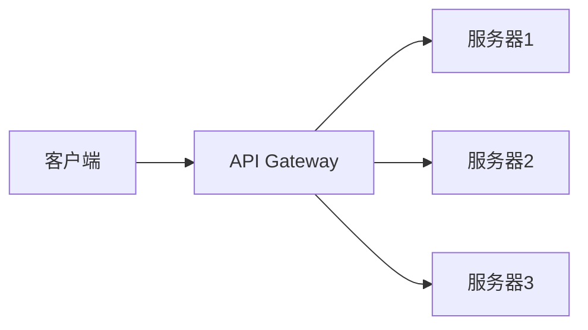

# 2020-03-25 悠云闲语

## 主题

一些简单实用的小设计(4)，API Gateway

## 什么是 API Gateway

API Gateway，或者说 API 网关，是借鉴物理网络的一个概念。物理网络中，网关是隔绝两个网络，两个网络间唯一的信息流动口。架构设计上，拿来了这个设计，将 API 网关放在客户端和真正服务端之间，充当桥梁。

## 为什么要有 API Gateway

答：这是系统建设的必要环节。当提供的服务变多、协议变多、语言变多后，前后端调试成本大量提升。同时，由于互联网的不安全性，势必需要在安全性上进行不断加强。而这种代码是大量雷同的，反复开发不利于集中管理。再之，用户量的不断增长，对系统提出自保要求，需要有手段保护自己，不被潜在大数量客户高频请求冲垮。这需要接口有限流、熔断等各种保护措施。这些措施和安全一样，重复性建设没有意义。

基于这种原因，技术性抽取了 API 网关，在其上实现上述内容，达到：

1. 路由，对外作为单点，对内将请求分发到对应服务器。
2. 聚合，对外作为单一请求暴露，对内将请求拆分为多次请求，从不同服务器获得结果，再最终归集后返回。
3. 保护，将内部的 API 保护在网关之后，由网关承担流量冲击，必要时限流甚至熔断。同时提供安全性保证。

## API Gateway 的进一步发展

微服务时代，API 网关借助注册中心、配置中心、监控中心，可以动态管理后端服务。可以在对外不停止服务的情况下，通过在网关上操作，达到：

1. 隔离问题服务器，分发流量到其他服务器，快速下线，方便进一步维护
2. 动态增减服务器，在实现资源的最大化利用

API 网关作为底层支撑中间件，向更专业化发展，在架构范围内重要性更高。

## 典型 API Gateway 实现介绍

**Kong**

[Kong https://konghq.com/](https://konghq.com/)

基础是 Nginx，使用 Lua，性能评估上较好

**Tyk**

[Tyk https://github.com/TykTechnologies/tyk](https://github.com/TykTechnologies/tyk)

Go 开发，基于 Go 自带的通讯底层

**自研**

可选择框架较多：Dubbo/Zuul/Netty等等，配合SpringCloud/SpringBoot，可以做得很轻量。

