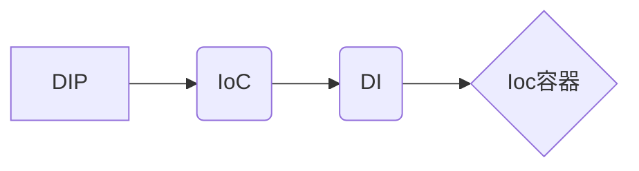

# 2020-03-27 悠云闲语

## 主题

一些简单实用的小设计(6)，控制反转，IoC(Inversion of Control)

## 什么是控制反转

IoC 可以认为是一种全新的**设计模式**，但是理论和时间成熟相对较晚，并没有包含在 GoF 中。

**依赖倒置原则（DIP）：**一种软件架构设计的原则（抽象概念）。

**控制反转（IoC）：**一种反转流、依赖和接口的方式（DIP的具体实现方式）。

**依赖注入（DI）：**IoC的一种实现方式，用来反转依赖（IoC的具体实现方式）。

**IoC容器：**依赖注入的**框架**，用来映射依赖，管理对象创建和生存周期（DI框架）。

可以说，有：

**依赖倒置原则，它转换了依赖，高层模块不依赖于低层模块的实现，而低层模块依赖于高层模块定义的接口**。通俗的讲，就是高层模块定义接口，低层模块负责实现。

> Bob Martins对DIP的定义：
> *高层模块不应依赖于低层模块，两者应该依赖于抽象。*
> *抽象不应该依赖于实现，实现应该依赖于抽象。*

以例子说明，

从上图中，我们发现高层模块的类依赖于低层模块的接口。因此，低层模块需要考虑到所有的接口。如果有新的低层模块类出现时，高层模块需要修改代码，来实现新的低层模块的接口。这样，就破坏了开放封闭原则。

在这个图中，我们发现高层模块定义了接口，将不再直接依赖于低层模块，低层模块负责实现高层模块定义的接口。这样，当有新的低层模块实现时，不需要修改高层模块的代码。

由此，我们可以总结出使用DIP的优点：

**系统更柔韧：**可以修改一部分代码而不影响其他模块。

**系统更健壮：**可以修改一部分代码而不会让系统崩溃。

**系统更高效：**组件松耦合，且可复用，提高开发效率。

我们常用的 Spring，就是一个轻量型 IoC 容器。

## 小结

实际上，我们在开发中，可以考虑自己的业务设计是不是能启用这类设计模式。