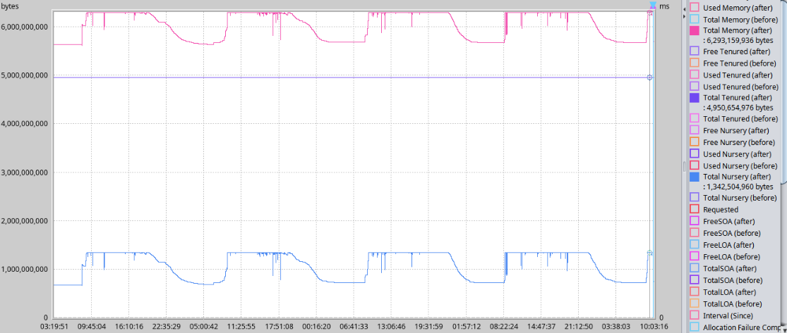
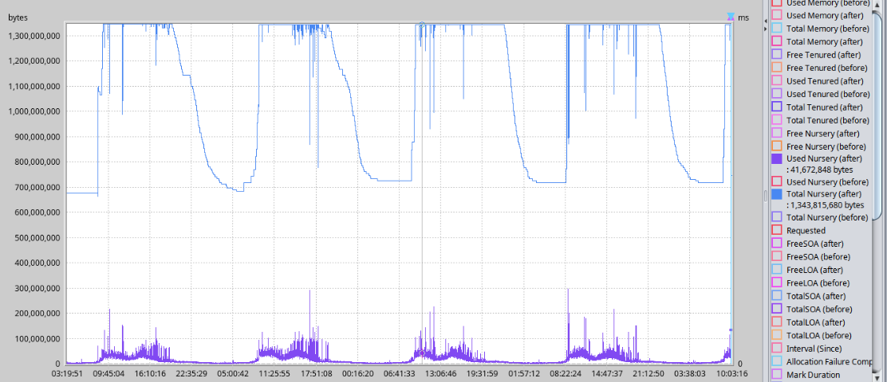

# 2020-04-15 悠云闲语

## 主题

借助GC日志，实际分析一个问题

## 问题

某系统在10点过19秒，触发`OOM`

## 分析

### 堆内存耗尽过程

通过`jca.jar`分析`native_stderr.log`，该`GC`日志表明内存耗尽过程

```verilog
[Www Mmm dd 09:58:25 yyyy] JVMDUMP039I Processing dump event "allocation", detail "18874384 bytes, type char[]" at yyyy/mm/dd 09:58:26 - please wait.  
[Www Mmm dd 09:58:25 yyyy] JVMDUMP013I Processed dump event "allocation", detail "18874384 bytes, type char[]".  
[Www Mmm dd 09:58:26 yyyy] JVMDUMP039I Processing dump event "allocation", detail "37748752 bytes, type char[]" at yyyy/mm/dd 09:58:26 - please wait.  
[Www Mmm dd 09:58:26 yyyy] JVMDUMP013I Processed dump event "allocation", detail "37748752 bytes, type char[]".  
[Www Mmm dd 09:58:28 yyyy] JVMDUMP039I Processing dump event "allocation", detail "75497488 bytes, type char[]" at yyyy/mm/dd 09:58:28 - please wait.  
[Www Mmm dd 09:58:28 yyyy] JVMDUMP013I Processed dump event "allocation", detail "75497488 bytes, type char[]".  
[Www Mmm dd 09:58:30 yyyy] JVMDUMP039I Processing dump event "allocation", detail "150994960 bytes, type char[]" at yyyy/mm/dd 09:58:31 - please wait.  
[Www Mmm dd 09:58:30 yyyy] JVMDUMP013I Processed dump event "allocation", detail "150994960 bytes, type char[]".  
[Www Mmm dd 09:58:34 yyyy] JVMDUMP039I Processing dump event "allocation", detail "301989904 bytes, type char[]" at yyyy/mm/dd 09:58:35 - please wait.  
[Www Mmm dd 09:58:34 yyyy] JVMDUMP013I Processed dump event "allocation", detail "301989904 bytes, type char[]".  
[Www Mmm dd 09:58:43 yyyy] JVMDUMP039I Processing dump event "allocation", detail "603979792 bytes, type char[]" at yyyy/mm/dd 09:58:43 - please wait.  
[Www Mmm dd 09:58:43 yyyy] JVMDUMP013I Processed dump event "allocation", detail "603979792 bytes, type char[]".  
[Www Mmm dd 09:58:59 yyyy] JVMDUMP039I Processing dump event "allocation", detail "1207959568 bytes, type char[]" at yyyy/mm/dd 09:58:59 - please wait.  
[Www Mmm dd 09:58:59 yyyy] JVMDUMP013I Processed dump event "allocation", detail "1207959568 bytes, type char[]".  
[Www Mmm dd 10:00:19 yyyy] JVMDUMP039I Processing dump event "systhrow", detail "java/lang/OutOfMemoryError" at yyyy/mm/dd 10:00:40 - please wait.  
[Www Mmm dd 10:00:19 yyyy] JVMDUMP032I JVM requested Snap dump using '/was_dump/srv1/Snap.yyyymmdd.100040.62586964.0274.trc' in response to an event  
[Www Mmm dd 10:00:19 yyyy] JVMDUMP010I Snap dump written to /was_dump/srv1/Snap.yyyymmdd.100040.62586964.0274.trc  
[Www Mmm dd 10:00:19 yyyy] JVMDUMP013I Processed dump event "systhrow", detail "java/lang/OutOfMemoryError".  
[Www Mmm dd 10:00:19 yyyy] JVMDUMP032I JVM requested Java dump using '/was_dump/srv1/javacore.yyyymmdd.100040.62586964.0273.txt' in response to an event  
[Www Mmm dd 10:00:19 yyyy] JVMDUMP010I Java dump written to /was_dump/srv1/javacore.yyyymmdd.100040.62586964.0273.txt  
[Www Mmm dd 10:00:19 yyyy] JVMDUMP013I Processed dump event "systhrow", detail "java/lang/OutOfMemoryError".  
[Www Mmm dd 10:00:19 yyyy] JVMDUMP032I JVM requested Heap dump using '/was_dump/srv1/heapdump.yyyymmdd.100040.62586964.0272.phd' in response to an event  
[Www Mmm dd 10:00:19 yyyy] JVMDUMP010I Heap dump written to /was_dump/srv1/heapdump.yyyymmdd.100040.62586964.0272.phd  
[Www Mmm dd 10:00:19 yyyy] JVMDUMP013I Processed dump event "systhrow", detail "java/lang/OutOfMemoryError".  
[Www Mmm dd 10:00:19 yyyy] JVMDUMP032I JVM requested System dump using '/was_dump/srv1/core.yyyymmdd.100040.62586964.0269.dmp' in response to an event  
[Www Mmm dd 10:00:19 yyyy] JVMDUMP010I System dump written to /was_dump/srv1/core.yyyymmdd.100040.62586964.0269.dmp  
```

从日志上可以看到:

- `09:58:25`需要分配`18874384`字节，`18M`
- `09:58:26`需要分配`37748752`字节，`36M`
- `09:58:28`需要分配`75497488`字节，`72M`
- `09:58:30`需要分配`150994960`字节，`144M`
- `09:58:34`需要分配`301989904`字节，`288M`
- `09:58:43`需要分配`603979792`字节，`576M`
- `09:58:59`需要分配`1207959568`字节，`1.125G`

可以看到，每次内存增长是以翻番的形式进行。至此，系统若再要分配内存，需要额外`1.125G`。

### `GC`统计情况

在`GC`分析工具中，时间记录统计信息有：

- **Longest Garbage Collections**

  ```verilog
  20,903 ms (Www Mmm dd 10:00:19 yyyy)
  <非同一天，隐去>
  6,685 ms  (Www Mmm dd 09:59:02 yyyy)
  2,358 ms  (Www Mmm dd 10:00:16 yyyy)
  <非同一天，隐去>
  ```

- **Shortest Garbage Collection Intervals**

  ```verilog
  0 ms (Www Mmm dd 09:59:00 yyyy)
  0 ms (Www Mmm dd 09:59:02 yyyy)
  0 ms (Www Mmm dd 09:59:09 yyyy)
  0 ms (Www Mmm dd 09:59:12 yyyy)
  0 ms (Www Mmm dd 09:59:14 yyyy)  
  ```

可见从`09:59:00`开始，不断进行`GC`，间隔非常小($0ms$)。耗时也非常厉害：

- `09:59:02`，耗时`6.685s`
- `10:00:16`，耗时`2.358s`
- `10:00:19`，耗时`20.903s`

说明`GC`努力回收内存，但仍然无法回收足够多的内存，直至`10:00:19`内存溢出。

在`GC分析工具`中，频次统计信息有：

- **Number of Java heap exhaustion** : 26       
- **Overall Garbage Collection overhead** : 1.55%    
- **Maximum Garbage Collection overhead** : 100% ( Www Mmm dd 09:59:00 yyyy)       
- **Number of 100% AF overhead** : 38   

目前看堆内存消耗严重，没有余量支持突发的内存分配。堆内存耗尽`26`次，`100%`分配失败发生`38`次，最大`GC`将所有内存都分析了一遍。

### `GC`工具论断

在`GC分析工具`中，论断如下：

- **List of Java heap failures(Refer to Java Heap Activity Analysis and Recommendations report section for details)**

  ```verilog
  Excessive Garbage Collection detected. 100% of time is spent within Java Garbage Collector  Www Mmm dd 10:00:19 yyyy
  <skip 24 times>
  Excessive Garbage Collection detected. 100% of time is spent within Java Garbage Collector  Www Mmm dd 10:00:19 yyyy
  ```

  由此，侧面也可以看到`10:00:19`，系统已执行了过多的`GC`。

### 堆内存占用情况

通过观察`JVM`内存占用，发现可用空间只有新生代的`1.5G`空间。而新生代中，不能回收的约`300M`。

全堆内存



新生代内存



### 新证据

当时的分析，到了这里，没了下文。因为无法定位问题位置。

但是这两天为了为大家讲解`native_stderr.log`结构，我不借助工具再仔细阅读了当时的`native_stderr.log`，得到了重要线索：

```xml
<allocation-stats totalBytes="1386284392" >
  <allocated-bytes non-tlh="3228912" tlh="1383055480" />
  <largest-consumer threadName="Thread-63" threadId="000001002461CC00" bytes="1083252760" />
</allocation-stats>
```

该线程`Thread-63`，持有着`1G+`的内存。这是重点怀疑对象。已转项目组跟进。

## 结论

工具虽好，但还是要学会自己理解文件内容，自己分析。
