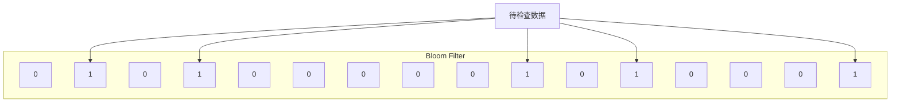
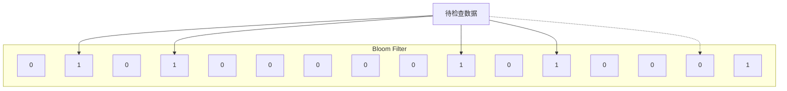

# 2020-03-18 时代银通分享

## 主题

结合实际业务介绍 Bloom Filter

## 业务需求

1. 有基表1个亿数据
2. 每日有变动数据3百万，需要更新到基表

**问题：**直接通过数据库操作 merge 更新实在太慢

## 解决方案

### 预处理

1. 选择合适的 Hash 算法构建 Bloom Filter
2. 将基表所有数据中的主键过一遍 Bloom Filter，生成基础过滤器
3. 生成的基础过滤器信息需保存，防止丢失

### 每日处理

1. 将处理好的3百万数据依次以主键过 Bloom Filter 过筛
2. 如果 Bloom Filter 确认存在，进入 update 队列；如果 Bloom Filter 确认不存在，进入 insert 队列
3. 分别处理 update 队列和 insert 队列。
   - 注意1：队列数据较多。建议使用批量方式处理，每次更新一定量。
   - 注意2：存在误报率，即所谓的假阳性（False Positive）。所以在处理更新时，需要处理更新结果，对更新记录为零的数据，改插插入队列（或单独的额外队列）。
4. 要使用新的3百万数据更新 Bloom Filter 筛子，保证下次使用时有效。

## Bloom Filter 介绍

简单说，就是一个 byte 数组+几组不同的 Hash 算法。

以下图为例，16bit 的数据，两个 byte，五个 Hash 算法。

某个预置数据，经过五组 Hash 算法后，得到这个筛子。

这时，我们拿两个新数据来检查，第一个数据和预置数据一样，第二个数据不一样。

**数据1**

一一匹配，表示该数据**可能**存在

**数据2**

可见，数据在某组 Hash 下指向第15位，但这一位为0，表示该数据**一定**不存在

## 参考文档

[布隆过滤器(Bloom Filter)详解 https://www.cnblogs.com/liyulong1982/p/6013002.html](https://www.cnblogs.com/liyulong1982/p/6013002.html)