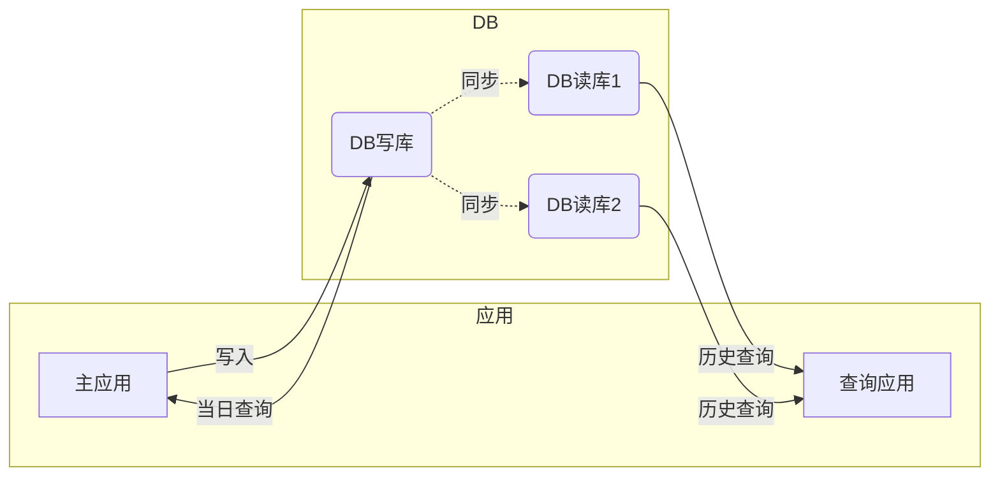

# 2020-03-24 悠云闲语

## 主题

一些简单实用的小设计(3)

## 问题

数据同时读写交互影响

## 解决方案

将数据库拆解为读数据库和写数据库。

### 写库

当日数据，都通过本数据库进行读写服务。日终时，将数据同步到读库。

### 读库

读库中数据，负责历史查询。日终时，接收写库同步过来的数据。

### 同步技术

**Oracle**

ADG

Active Data Guard 是 Oracle Database 企业版的一个选件许可。Active Data Guard 支持高级功能，在 Data Guard 基本功能的基础上进行了扩展。

> Data Guard 提供管理、监视和自动化软件，用于创建和维护生产数据库的一个或多个同步副本，保护 Oracle  数据免受故障、灾难、人为错误和数据损坏的影响，同时为任务关键型应用提供高可用性。Data Guard 包括在 Oracle Database  企业版中。

这些高级功能包括：

- **实时查询** — 将只读负载分流到新的备用数据库
- **自动块修复** — 自动修复物理损坏，该操作对用户是透明的
- **远程同步** — 任意距离均可实现零数据丢失保护
- **备用块更改跟踪** — 在活动备用数据库上启用增量备份
- **Active Data Guard 滚动升级** — 可轻松缩短计划停机时间
- **全局数据库服务** — 可在复制数据库之间实现负载平衡和服务管理
- **应用连续性** — 将停机透明地呈现给用户

**MySQL**

Binlog，包含了一些事件，这些事件描述了数据库的改动，如建表、数据改动等，也包括一些潜在改动，比如 `DELETE FROM ran WHERE bing = luan`，然而一条数据都没被删掉的这种情况。除非使用 Row-based logging，否则会包含所有改动数据的 SQL Statement。

Binlog 两个重要的用途——复制和恢复。比如主从表的复制，和备份恢复什么的。

从上层来看，复制分成三步：

1. master将改变记录到二进制日志(binary log)中（这些记录叫做二进制日志事件，binary log events，可以通过show binlog events进行查看）；
2. slave将master的binary log events拷贝到它的中继日志(relay log)；
3. slave重做中继日志中的事件，将改变反映它自己的数据。

## 小结

读写分离情况下，大量查询压力分担到读库上，对写库的读写性能提升明显。

## BTW

昨天的，实际上应该是读写分离后进一步进行的。补上昨天欠着的。