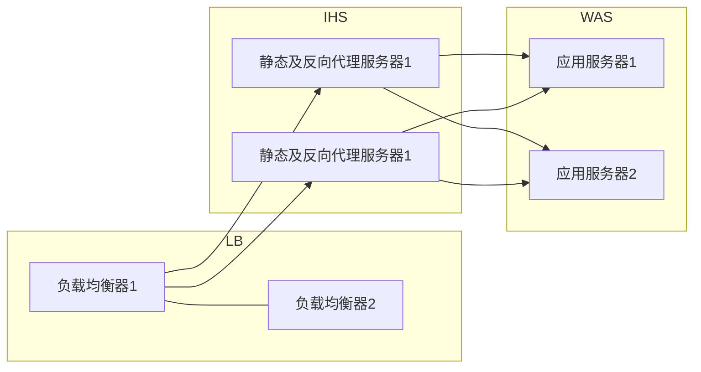
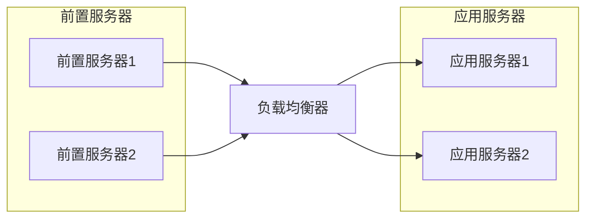
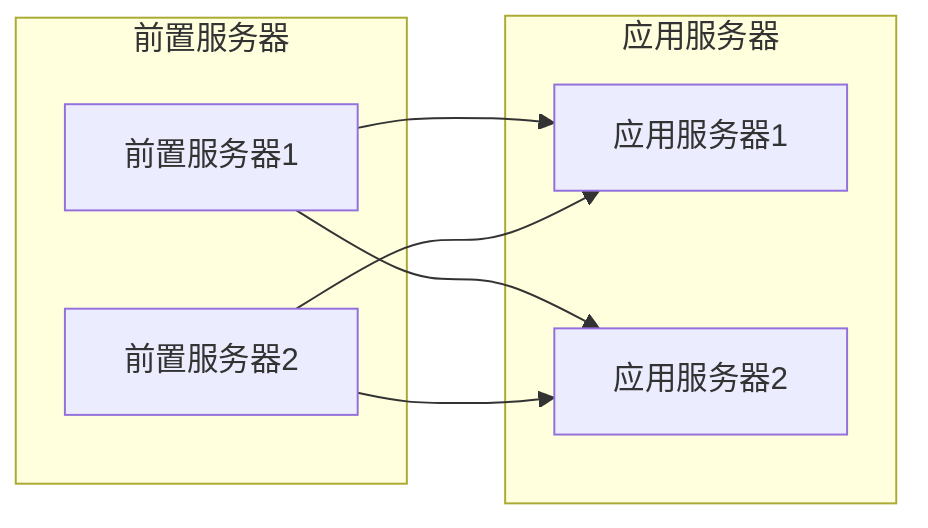

# 2020-03-26 悠云闲语

## 主题

一些简单实用的小设计(5)，负载均衡

## 什么是负载均衡

负载均衡*（Load Balance）*其意思就是分摊到多个操作单元上进行执行，例如Web服务器、FTP服务器、企业关键应用服务器和其它关键任务服务器等，从而共同完成工作任务。

## 为什么需要负载均衡

互联网早期，业务流量比较小并且业务逻辑比较简单，单台服务器便可以满足基本的需求；但随着互联网的发展，业务流量越来越大并且业务逻辑也越来越复杂，单台机器的性能问题以及单点问题凸显了出来，因此需要多台机器来进行性能的水平扩展以及避免单点故障。

## 负载均衡的演变

### 按工作层分

**DNS 轮询**

早期以 DNS 轮询为主，分配不同服务器。但该模式对变化的响应不及时。


**链路层负载**

数据链路层负载均衡是指在通信协议的数据链路层修改mac地址进行负载均衡。
这种数据传输方式又称作三角传输模式，负载均衡数据分发过程中不修改IP地址，**只修改目的的mac地址**，通过配置真实物理服务器集群所有机器虚拟IP和负载均衡服务器IP地址一样，从而达到负载均衡，这种负载均衡方式又称为直接路由方式（DR）。

著名的 LVS，就是这类负载的典型。


**四层负载**

也就是主要通过报文中的目标地址和端口，再加上负载均衡设备设置的服务器选择方式，决定最终选择的内部服务器。

本质是替换原始 TCP/IP 包中的目标地址，某些更进一步，对源地址也要修改，改为负载均衡器地址。


**七层负载**

也称为“内容交换”，也就是主要通过报文中的真正有意义的应用层内容，再加上负载均衡设备设置的服务器选择方式，决定最终选择的内部服务器。

该模式下，负载均衡器会阅读报文，拆解报文，再进行分发。


### 按软硬件分

**软负载**

以特定软件为基础，运行在标准服务器上。比如 LVS ， 比如 HAProxy，比如 keepalive，比如 nginx。

**硬负载**

提供特定硬件，通过芯片等固化算法，提升处理性能。常见开发商有：F5，Radware，Cisco，国产的华为等都有产品。

## 负载均衡算法

**随机/Random**


完全靠随机算法分配。

```java
public void random(){
    List<String> keyList = new ArrayList<String>(serverMap.keySet());
    Random random = new Random();
    int idx = random.nextInt(keyList.size());
    String server = keyList.get(idx);
    System.out.println(server);
}
```

**带权随机/WeightRandom**

随机，按权重设置随机概率。在一个截面上碰撞的概率高，但调用量越大分布越均匀，而且按概率使用权重后也比较均匀，有利于动态调整提供者权重。

```java
public void weightRandom(){
    Set<String> keySet = serverMap.keySet();
    List<String> servers = new ArrayList<String>();
    for(Iterator<String> it = keySet.iterator();it.hasNext();){
        String server = it.next();
        int weithgt = serverMap.get(server);
        for(int i=0;i<weithgt;i++){
            servers.add(server);
        }
    }
    String server = null;
    Random random = new Random();
    int idx = random.nextInt(servers.size());
    server = servers.get(idx);
    System.out.println(server);
}
```

**轮询/Round Robbin**

当服务器群中各服务器的处理能力相同时，且每笔业务处理量差异不大时，最适合使用这种算法。 轮循，按公约后的权重设置轮循比率。存在慢的提供者累积请求问题，比如：第二台机器很慢，但没挂，当请求调到第二台时就卡在那，久而久之，所有请求都卡在调到第二台上。

```java
private Integer pos = 0;
public void roundRobin(){
    List<String> keyList = new ArrayList<String>(serverMap.keySet());
    String server = null;
    synchronized (pos){
        if(pos > keyList.size()){
            pos = 0;
        }
        server = keyList.get(pos);
        pos++;
    }
    System.out.println(server);
}
```


**加权轮询/Weighted Round Robbin**

为轮询中的每台服务器附加一定权重的算法。比如服务器1权重1，服务器2权重2，服务器3权重3，则顺序为：

> 1-2-2-3-3-3-1-2-2-3-3-3- ......

```java
public void weightRoundRobin(){
    Set<String> keySet = serverMap.keySet();
    List<String> servers = new ArrayList<String>();
    for(Iterator<String> it = keySet.iterator();it.hasNext();){
        String server = it.next();
        int weithgt = serverMap.get(server);
        for(int i=0;i<weithgt;i++){
            servers.add(server);
        }
    }
    String server = null;
    synchronized (pos){
        if(pos > keySet.size()){
            pos = 0;
        }
        server = servers.get(pos);
        pos++;
    }
    System.out.println(server);
}
```

**最少连接/Least Connections**
在多个服务器中，与处理连接数(会话数)最少的服务器进行通信的算法。即使在每台服务器处理能力各不相同，每笔业务处理量也不相同的情况下，也能够在一定程度上降低服务器的负载。

代码，略。此代码较复杂。

**加权最少连接/Weighted Least Connection**
为最少连接算法中的每台服务器附加权重的算法，该算法事先为每台服务器分配处理连接的数量，并将客户端请求转至连接数最少的服务器上。

代码，略。此代码较复杂。

**普通哈希**

基于特定值，哈希获得服务器地址。

**一致性哈希**

前面已经讲过此模式，此略。

## 在实际使用中运用负载均衡

### 场景1 负载均衡常见部署模式



### 场景2 长连接负载均衡

前几年工作时，碰到过一个场景需要使用长连接。但是长连接无法直接通过负载均衡器得到负载均衡效果。一直无法解决这个问题。

考虑一个情况：



这里的链接都是长连接。

如果这时应用服务器1挂了，这时前置1/2机都会将连接归集到应用服务器2。其后应用服务器1再起来，其实无法接到任何新连接。应用服务器2扛了所有本应两台服务器扛的压力。

想到的办法都是定时断连接，或者随机断连接。都无法很好解决这个问题。

直到我看了 Dubbo 的代码，才发现解决办法：抛弃负载均衡器，将负载均衡算法内置，内置到前置服务器。换句话说，就是将主动性拿在自己手里。（**我的问题在于思维定势：前置与应用服务器之间只维护一个有效连接。**）

这样，前置与应用服务器之间就变成这样：



这样，一旦一台应用服务器崩溃，也能顺利漂移到另一台。而当应用服务器再次启动时，前置通过心跳探测侦测到，又可以加入到可使用服务器队列中继续使用。

## 小结

负载均衡在实际开发过程中使用机率较高，不一定需要自己写代码，但必须了解内在逻辑。**上述的代码，也就是示例，不能实际用在生产上！！！**

