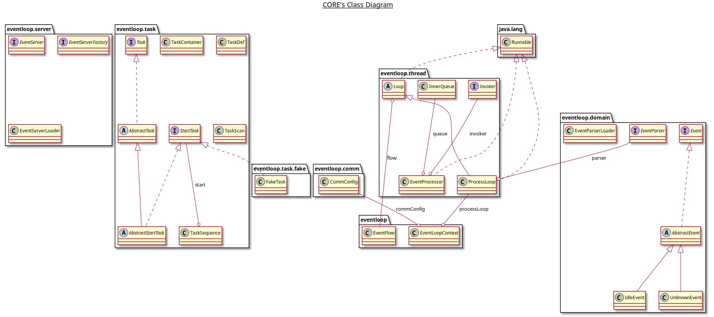

# 2020-04-08 悠云闲语

## 主题

一个简易结构的反应堆模型

## 反应堆模型

这是 Netty 架构下的反应堆模型，基于事件分发。这个模型非常漂亮，也非常高效。借鉴这个，我们可以做一些设计上的尝试。

## 简易实现

将代码分解为几大块：

- eventloop

  总控，启动停止都在这里

- eventloop.server

  定义各类服务器，只定义接口，通过SPI加载具体实现

- eventloop.task

  定义任务，将一个事件分解到各个任务中依次处理

- eventloop.thread

  通过线程ProcessLoop进行反应，分发到Invoker执行

- eventloop.domain

  事件定义，定义体系，具体事件由使用者定义