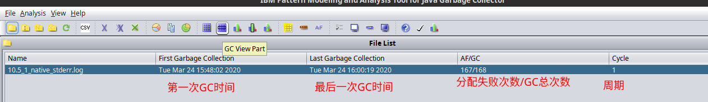
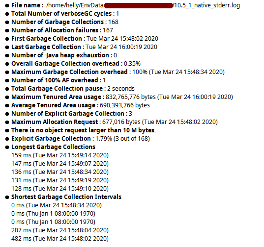

# 2020-04-10 悠云闲语

## 主题

IBM JDK GC日志

## IBM JDK GC日志

### 在哪里

\<WAS\>/profiles/\<server\>/logs/native_stderr.log

### 如何生成

WAS 控制台勾选详细垃圾回收

实际上就是 JVM 参数：`-verbose:gc`

### 使用工具打开

使用工具`ga458.jar`（可能有其他版本），进行分析

这是打开后能看到的上半部



这是该文件的概要信息



- File name : 文件名

- Total Number of verboseGC cycles : GC周期

- Number of Garbage Collections : GC次数

- Number of Allocation failures : 分配失败次数

- First Garbage Collection : 第一次GC时间

- Last Garbage Collection : 最后一次GC时间

- Number of  Java heap exhaustion : 堆耗尽次数

  **备注**：一旦这个数据大于0，说明内存不够或内存有泄漏

- Overall Garbage Collection overhead : 整体GC开销

  **备注**：越低越好

- Maximum Garbage Collection overhead : 最大GC开销

  **备注**：越低越好

- Number of 100% AF overhead : 100%分配失败次数

  **备注**：越低越好

- Total Garbage Collection pause : 总GC暂停时间

  **备注**：越短越好

- Maximum Tenured Area usage : 最大持久代占用

- Average Tenured Area usage : 平均持久代占用

- Number of Explicit Garbage Collection : 显式GC次数

  **备注**：也就是显式调用`System.gc()`次数

- Maximum Allocation Request : 最大分配请求大小

  **备注**：也就是最大一次分配内存申请的大小

- There is no object request larger than 10 M bytes. 超10M分配请求次数。

  **备注**：最好没有，就比如这个。如果有，需要观察。非查询类，一般不会超。

- Explicit Garbage Collection : 显式GC占比

  **备注**：越低越好

- Longest Garbage Collections 最长GC排列，前五个

  **备注**：越短越好

- Shortest Garbage Collection Intervals 最短GC间隔排列，前五个

  **备注**：越长越好

### 使用编辑器打开

使用顺手的编辑器，可以打开此文件。

内部为`xml`格式。

```xml
<?xml version="1.0" ?>

<verbosegc xmlns="http://www.ibm.com/j9/verbosegc" version="R26_Java726_SR9_20151007_1402_B270944">
```

这表明系统一次新的启动。

紧接着会是一些参数收集

```xml
<initialized id="1" timestamp="20xx-xx-xxTxx:xx:xx.xxx">
...
************ Start Display Current Environment ************
Log file started at: [xx-x-xx xx:xx:xx:xxx GMT+08:00]
************* End Display Current Environment *************
```

直到这里为止

其下是GC信息，会以空行间隔每次GC输出的信息。

## 建议

自己找一份native_stderr.log，主动分析一下，主动阅读一下，对熟悉JVM内存有好处。
